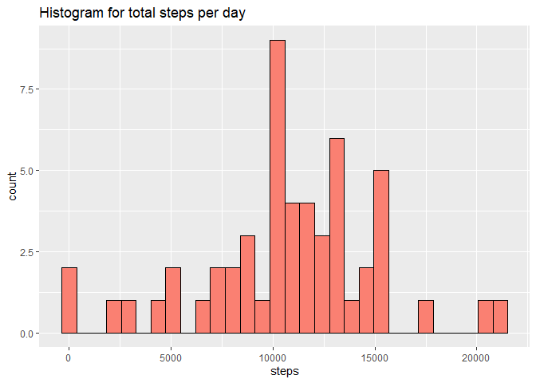
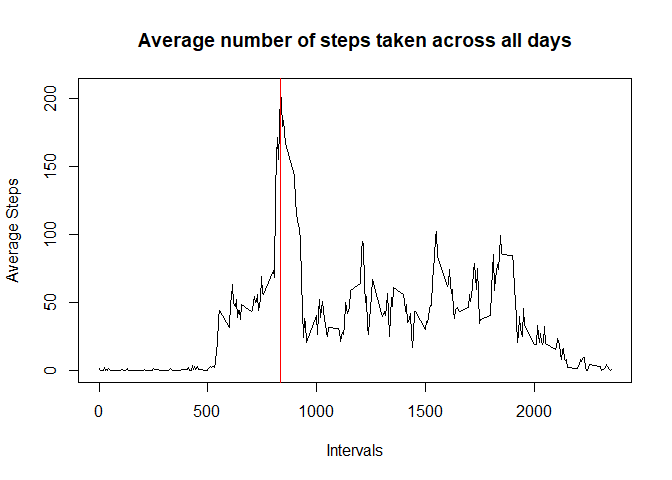
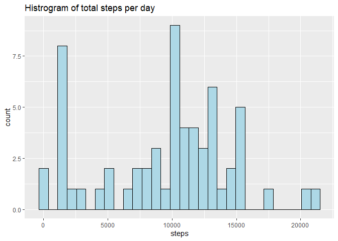
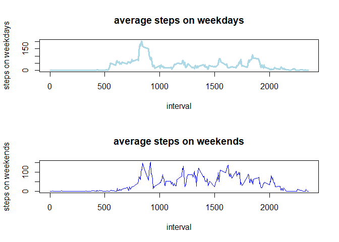

## Introduction  
It is now possible to collect a large amount of data about personal movement using activity monitoring devices such as a Fitbit, Nike Fuelband, or Jawbone Up. These type of devices are part of the “quantified self” movement – a group of enthusiasts who take measurements about themselves regularly to improve their health, to find patterns in their behavior, or because they are tech geeks. But these data remain under-utilized both because the raw data are hard to obtain and there is a lack of statistical methods and software for processing and interpreting the data.  

## A brief overview  
This assignment makes use of data from a personal activity monitoring device. This device collects data at 5 minute intervals through out the day. The data consists of two months of data from an anonymous individual collected during the months of October and November, 2012 and include the number of steps taken in 5 minute intervals each day.  
#### Variables  
* steps: Number of steps taking in a 5-minute interval (missing values are coded as \color{red}{\verb|NA|}NA)  

* date: The date on which the measurement was taken in YYYY-MM-DD format   

* interval: Identifier for the 5-minute interval in which measurement was taken   

## Loading and preprocessing the data  
#### Loading  


```r
url<-"https://d396qusza40orc.cloudfront.net/repdata%2Fdata%2Factivity.zip"
destfile<-"C:/Users/Hp/Desktop/activity.zip"
download.file(url,destfile)   ## downloading the data
unzip("activity.zip")

activitydata<-read.csv("activity.csv")  ## reading the data
```

#### Processing  
* We shall omit the missing values for now as per instructions.  


```r
activitydata$date=as.Date(activitydata$date)  ## transforming to Date class 
activityData<-na.omit(activitydata)    ## omitting the missing values
```

## What is mean total number of steps taken per day?  


```r
total.step<- aggregate(steps~date,data=activityData,sum)   ## total number of steps per day
summary(total.step)  ## calculating summary statistics
```

```
##       date                steps      
##  Min.   :2012-10-02   Min.   :   41  
##  1st Qu.:2012-10-16   1st Qu.: 8841  
##  Median :2012-10-29   Median :10765  
##  Mean   :2012-10-30   Mean   :10766  
##  3rd Qu.:2012-11-16   3rd Qu.:13294  
##  Max.   :2012-11-29   Max.   :21194
```

```r
## the histogram for the total number of steps taken each day
library(ggplot2)
g<-ggplot(total.step,aes(x=steps))
g<-g+geom_histogram(color="black",fill="salmon")+ggtitle("Histogram for total steps per day")
g
```

```
## `stat_bin()` using `bins = 30`. Pick better value with `binwidth`.
```

<!-- -->

* *Hence the mean total number of steps taken per day is 10766*  

## What is the average daily activity pattern?  


```r
avg.int<-aggregate(steps~interval,data=activityData,mean)
which(avg.int$steps==max(avg.int$steps))  ## index for the maximum average steps
```

```
## [1] 104
```

```r
avg.int[104,]    ## interval containing maximum 
```

```
##     interval    steps
## 104      835 206.1698
```

```r
plot(avg.int,type="l",xlab="Intervals",ylab="Average Steps",
     main="Average number of steps taken across all days")
abline(v=835,col="red")  ## line pointing the 5 min interval 
```

<!-- -->

* *The interval 830-835 (since 5-min interval value is 835) on average across all the days in the dataset, contains the maximum number of steps.  

## Imputing missing values  

#### Total number of missing values  

```r
sum(is.na(activitydata))  ## total number of rows with NA values
```

```
## [1] 2304
```

#### Strategy for imputing missing values  
* We shall replace the NA values with the median of the interval since median is a robust measure.  


```r
library(dplyr)
```

```
## 
## Attaching package: 'dplyr'
```

```
## The following objects are masked from 'package:stats':
## 
##     filter, lag
```

```
## The following objects are masked from 'package:base':
## 
##     intersect, setdiff, setequal, union
```

```r
## calculating intervalwise median
median.missing<- aggregate(steps~interval,data=activityData,median)
replace.missing<-activitydata 
## creating a dataset with missing values filled in
replace.missing$steps<-ifelse(is.na(activitydata$steps),median.missing$steps[median.missing$interval 
                                              %in% activitydata$interval],activitydata$steps)

## total steps taken per day after imputing missing values
filled.data <- aggregate(steps~date,data=replace.missing,sum)

g<- ggplot(filled.data,aes(x=steps))  ## histogram
g<- g+ geom_histogram(color="black",fill="lightblue")+ggtitle("Histrogram of total steps per day")
g
```

```
## `stat_bin()` using `bins = 30`. Pick better value with `binwidth`.
```

<!-- -->

```r
## calculating summary statistics with filled missing data
summary(filled.data)
```

```
##       date                steps      
##  Min.   :2012-10-01   Min.   :   41  
##  1st Qu.:2012-10-16   1st Qu.: 6778  
##  Median :2012-10-31   Median :10395  
##  Mean   :2012-10-31   Mean   : 9504  
##  3rd Qu.:2012-11-15   3rd Qu.:12811  
##  Max.   :2012-11-30   Max.   :21194
```

* *Since we were replacing the missing values with the median of the interval, it was expected to see a decline in values as a lot of values were replaced with 0 and smaller ones. And as result the mean has decreased by 1262 units and the median is decreased by 370 units.*  


## Are there differences in activity patterns between weekdays and weekends?  

#### Creating a new factor variable and using the base plot system for the plot  


```r
## creating a new category
category<-ifelse(!weekdays(replace.missing$date) %in% 
                                      c("Saturday","Sunday"),"Weekday","weekend")

## pasting the new column
replace.missing<-data.frame(replace.missing,category)

## subsetting by category
weekdata<-subset(replace.missing,category=="Weekday")
weekenddata<-subset(replace.missing,category=="weekend")

## average by category
avg.week<-aggregate(steps~interval,data=weekdata,mean)
avg.weekend<-aggregate(steps~interval,data=weekenddata,mean)

## panel plot of the average number of steps taken, averaged across all weekday days or weekend days
par(mfrow=c(2,1))
plot(avg.week,type="l",col="lightblue",lwd=3,ylab="steps on weekdays",main="average steps on weekdays")
plot(avg.weekend,type="l",col="blue",ylab="steps on weekends",main="average steps on weekends")
```

<!-- -->

* Steps taken on weekends seems more balanced across the day.  
